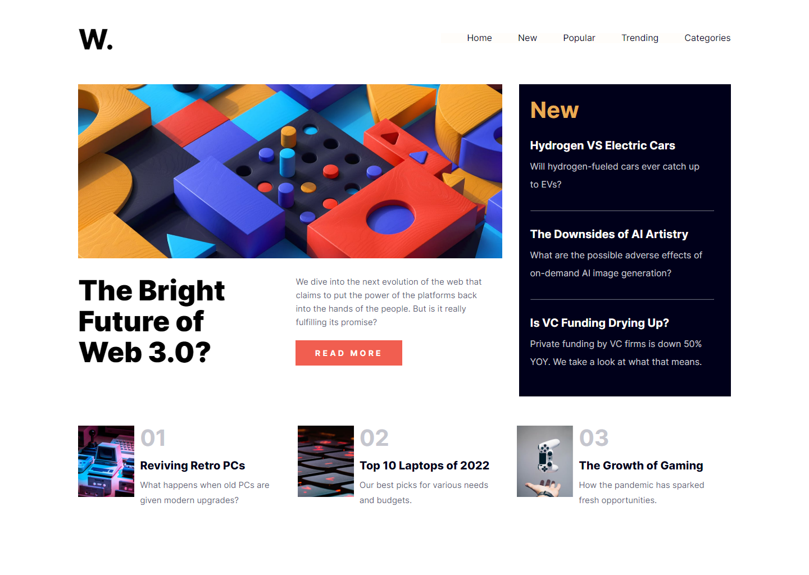
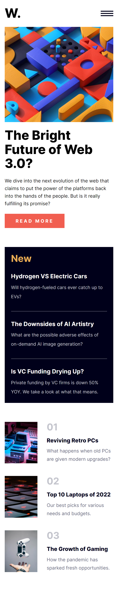

# Frontend Mentor - News homepage solution

This is a solution to the [News homepage challenge on Frontend Mentor](https://www.frontendmentor.io/challenges/news-homepage-H6SWTa1MFl). Frontend Mentor challenges help you improve your coding skills by building realistic projects.

## Table of contents

- [Overview](#overview)
  - [Screenshot](#screenshot)
  - [Links](#links)
- [My process](#my-process)
  - [Built with](#built-with)
  - [Useful resources](#useful-resources)
- [Author](#author)

## Overview

### Screenshot

Desktop

Movile

### Links

- Solution URL: [GitHub Solution](https://github.com/jordanbichot/news-homepage-main.git)
- Live Site URL: [Live Site](https://fem-news-homepage-jordan.netlify.app/)

## My process

### Built with

- Semantic HTML5 markup
- CSS custom properties
- Flexbox
- CSS Grid
- Mobile-first workflow

### Useful resources

- [Self-hosting fonts explained (including Google fonts) // @font-face tutorial](https://www.youtube.com/watch?v=zK-yy6C2Nck)
- [How to make darken Background Image](https://www.youtube.com/watch?v=CQzHzsSLa_w)
- [Learn CSS Animations In 20 Minutes - For Beginners](https://www.youtube.com/watch?v=SgmNxE9lWcY&t=4s)
- [Exploring CSS Grid](https://www.youtube.com/watch?v=yVVnFgycdOA&t=8s)

## Author

- Jordan Miguel Bichot Pérez - [FinTech Samurais](https://fintechsamurais.com/)
- Frontend Mentor - [@JordanBichot](https://www.frontendmentor.io/profile/JordanBichot)
- GitHub - [@jordanbichot](https://github.com/jordanbichot)
- LinkedIn - [Jordan Miguel Bichot Pérez](https://www.linkedin.com/in/jordan-miguel-bichot-p%C3%A9rez-613172225)
- Twitter - [@BichotJordan](https://twitter.com/BichotJordan?t=lu5q3WUeYHh3oWaySHXjIg&s=09)
